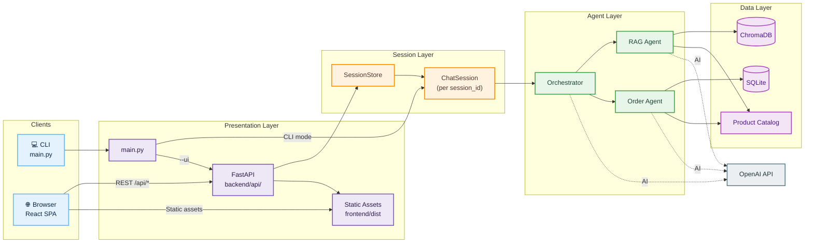
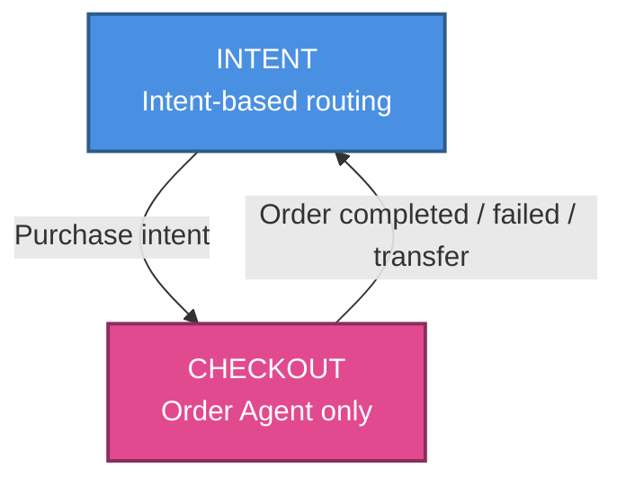

# Architecture

## 1. High-Level Overview

**Cecilia AI** is a conversational shopping assistant for product inquiries and order processing. It uses a **multi-agent backend** (LangChain + OpenAI) with two user-facing surfaces:

| Surface | Stack | Entry point |
|---------|-------|-------------|
| **CLI** | Python | `uv run backend/main.py` |
| **Web UI** | React + TypeScript (Vite) → FastAPI → agents | `uv run backend/main.py --ui` |

The web UI is the primary interface: a React SPA talks to a FastAPI server, which routes each browser tab to an isolated chat session backed by the same orchestrator and agents used by the CLI.

### Core Technologies

**Backend**
- **Language:** Python 3.12+
- **Orchestration:** LangChain
- **LLM:** OpenAI (GPT-4o-mini)
- **API:** FastAPI + Uvicorn
- **Vector database:** ChromaDB (local)
- **Relational database:** SQLite (via SQLAlchemy)
- **Dependency management:** `uv`

**Frontend**
- **Framework:** React 19 + TypeScript
- **Build / dev:** Vite
- **Routing:** React Router
- **Styling:** Tailwind CSS v4

## 2. System Architecture



## 3. Project Structure

```
ecommerce-bot/
├── frontend/                 # React SPA (Cecilia AI UI)
│   ├── src/
│   │   ├── api/              # fetch wrappers for /api/*
│   │   ├── components/       # chat, orders, layout
│   │   ├── hooks/            # useChat, useOrders
│   │   └── pages/            # ChatPage, OrdersPage
│   └── dist/                 # production build (served by FastAPI)
├── backend/
│   ├── agents/               # Orchestrator, RAG, Order agents
│   ├── api/                  # FastAPI app, schemas, SessionStore
│   ├── database/             # products, orders, ChromaDB
│   ├── chat/                 # ChatSession (orchestrator + history)
│   └── main.py               # CLI + --ui entry point
├── data/                     # products.json, ecommerce.db, chroma/
└── docs/
    └── architecture.md
```

## 4. Presentation Layer

### A. CLI (`backend/main.py`)

The CLI runs a single `ChatSession` in-process. There is no HTTP layer and no session IDs—one terminal run equals one conversation.

### B. Web UI

**Production** (`uv run backend/main.py --ui`):

1. Uvicorn serves FastAPI on port 8000 (default).
2. Built assets from `frontend/dist` are mounted at `/` (SPA fallback).
3. API routes live under `/api/*` on the same origin.

**Development** (`uv run backend/main.py --ui --dev`):

1. FastAPI runs API-only with CORS for `localhost:5173`.
2. Vite dev server (`cd frontend && npm run dev`) serves the UI and proxies `/api` to port 8000.

**Frontend routes**

| Path | Page | Purpose |
|------|------|---------|
| `/` | `ChatPage` | Chat with Cecilia AI |
| `/orders` | `OrdersPage` | List orders from `GET /api/orders` |

**Session identity**

- The browser generates a UUID and stores it in `localStorage` (`cecilia-session-id`).
- Every chat request includes `session_id` so the server can isolate history, orchestrator state, and cart per tab/user.

### C. HTTP API (`backend/api/`)

| Method | Path | Description |
|--------|------|-------------|
| `GET` | `/api/health` | Health check |
| `POST` | `/api/chat` | `{ session_id, message }` → `{ reply }` |
| `POST` | `/api/session/reset` | Clear history, cart, and orchestrator state for `session_id` (204) |
| `GET` | `/api/orders` | Recent orders for the orders page |

`ChatSession` (`backend/chat/session.py`) wraps one `Orchestrator` instance and chat history per conversation. `SessionStore` maps `session_id` → session, with a cap of 100 sessions (oldest evicted). The CLI uses the same `ChatSession` class for a single in-process conversation.

## 5. Agent Architecture

### A. The Orchestrator (`backend/agents/orchestrator.py`)

The central router directing user intents to specialized agents.

- **Routing logic:** LLM classifier for "product search" vs "placing an order".
- **State management:** Enum-based state machine (`OrchestratorState`):
    - `INTENT`: Default; routes by intent classification.
    - `CHECKOUT`: Locked to Order Agent until checkout completes, fails, or transfers.
    - Transitions via `should_exit_checkout_mode()` on Order Agent responses.
- **Cart management:** In-memory `self._cart` per orchestrator instance (therefore per web session). Cleared after successful order creation.

### B. Specialized Agents

1. **RAG Agent (`backend/agents/rag_agent.py`)**
    - **Purpose:** Answers questions about products.
    - **Mechanism:** Hybrid search—exact match by ID/name first, then ChromaDB semantic search.
    - **Tools:** `retrieve_products`, `transfer_to_order_agent`.

2. **Order Agent (`backend/agents/order_agent.py`)**
    - **Purpose:** Checkout flow.
    - **Mechanism:** Collects customer details, validates stock, creates orders.
    - **Tools:** `add_to_cart`, `remove_from_cart`, `view_cart`, `create_order`, `transfer_to_rag_agent`.
    - **Protocol:** Structured `OrderResponse` statuses (`collecting_info`, `confirming`, `completed`).

### Middleware Configuration

All agents use LangChain middleware to cap LLM and tool calls:

| Agent | Model calls | Tool limits (notable) |
|-------|-------------|------------------------|
| Orchestrator | 3 | — |
| RAG | 5 | — |
| Order | 10 | `create_order`: 1; `view_cart`: 2; `add_to_cart`: 3 |

### Chat History Strategy

| Agent | Needs history? | Reason |
|-------|----------------|--------|
| RAG | No | Stateless search per query |
| Order | Yes | Multi-turn checkout, product IDs from prior turns |

- Order Agent receives truncated history from the orchestrator.
- Order → RAG transfer passes `chat_history=[]` to avoid timeouts on large product listings.

### History Truncation

The orchestrator keeps the last **10** messages when passing history to agents (zero extra LLM cost vs summarization; recent context matters most for shopping conversations).

## 6. Data Layer

1. **Product Catalog (`backend/database/products.py`)**
    - Source: `data/products.json`
    - Exact lookup + ChromaDB embeddings for hybrid RAG search

2. **Order Management (`backend/database/orders.py`)**
    - SQLite: `data/ecommerce.db`
    - SQLAlchemy models: `Order`, `OrderItem`

## 7. Data Flow

### CLI path

1. User input in `main.py` → `ChatSession.send()`.
2. Orchestrator routes to RAG or Order agent.
3. Response printed to terminal; history appended inside `ChatSession`.

### Web UI path

1. User sends message from React → `POST /api/chat`.
2. FastAPI resolves `session_id` via `SessionStore.get()`.
3. `ChatSession.send()` calls `Orchestrator.invoke()` and persists history server-side.
4. Reply returned as JSON; UI renders in `ChatThread`.
5. "Clear chat" → `POST /api/session/reset` clears UI messages, chat history, orchestrator state (including cart), for the same `session_id`.

### Orchestrator routing (both paths)

1. If state is `CHECKOUT` → Order Agent directly.
2. If state is `INTENT` → classify intent:
   - Product → RAG Agent → hybrid search → response.
   - Purchase → Order Agent → `CHECKOUT` → cart tools → response.
3. Order Agent may `create_order` (reads cart, clears on success).
4. Orchestrator updates state via `should_exit_checkout_mode()`.
5. Formatted response returned to CLI or API client.

## 8. State Management (Orchestrator)

```python
class OrchestratorState(str, Enum):
    INTENT = "intent"
    CHECKOUT = "checkout"
```



## 9. Cart Architecture

The cart lives on each `Orchestrator` instance (`self._cart`):

- **Web:** One cart per `session_id` (isolated orchestrator per session).
- **CLI:** One cart per terminal session.
- **Lifecycle:** Persists for the conversation; cleared when `create_order` succeeds.
- **Structure:** `{ product_id, product_name, quantity, unit_price }[]`

**Why in-memory cart (not history-only)?**

- Reliable quantities and line items across turns
- Explicit `view_cart` / `remove_from_cart` UX
- `create_order` reads the cart directly instead of parsing LLM memory

**Tradeoff:** Cart and session state are lost on server restart (acceptable for local/demo use).

## 10. Operational Notes

| Topic | Behavior |
|-------|----------|
| **Multi-user (web)** | Supported via `session_id`; each browser profile/tab with its own ID gets isolated orchestrator + cart |
| **Session eviction** | After 100 active sessions, oldest session is dropped from memory |
| **Persistence** | Orders persist in SQLite; chat/cart/orchestrator state do not |
| **Payments** | Simulated only—no payment gateway integration |
